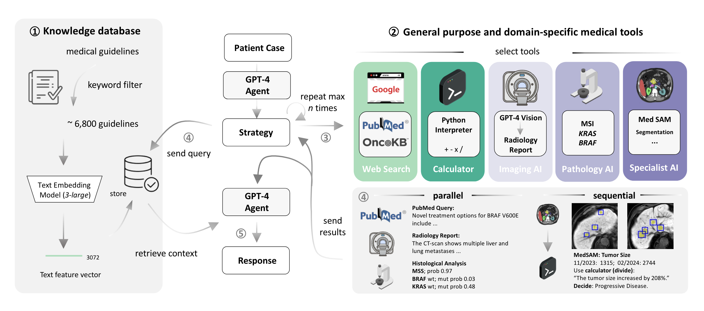

# Repository for: Autonomous AI Agents for Clinical Decision Making in Oncology
⚠️ This repository is currently under construction. Usage might change in the future. 

⚠️ The current agent implementation uses test functions for the image segmentation and genetic modeling tasks as the original implementation requires external repositories that are challenging to setup. We are working on a solution to simplify their setup in the very near future. The provided test functions (```agent_tools_dummy.py```) are implemented as agent tools without any changes to their original implementation (```agent_tools.py```) and have therefore *no* influence on the LLM-Agents behaviour.



## Software Requirements
All experiments were run on an Apple MacBook Pro M2 Max 96GB 2023.
No special hardware is required, if running certain models with hardware acceleration, it is desired to have a CUDA-compatible GPU to speed up the process.

## General Setup Instructions

Please follow the steps below:

#### 1. **Python Installation**:
Install Python from source. We used Python 3.11.6 throughout this project. 
#### 2. **Dependency Installation**: 

Clone this repository:
  ```
  git clone https://github.com/Dyke-F/LLM_RAG_Agent.git
  ```

This process might take around 1 minute.

Set up a clean python3 virtual environment, i.e. 

  ```
  python3 -m venv medvenv
  source medvenv/bin/activate
  ```

Install necessary dependencies:
  ```bash
  pip install -r requirements.txt
  ```

3. **Repository Structure**:
```
.env
RAGent/DSPY.
├── agent_tools_dummy.py                 # dummy implementation of agent tools returning defaults for fast debugging and demonstrations
├── agent_tools.py                       # Actual implementation of the agent tools. 
├── chroma_db_retriever.py               # Retriever Class for RAG, modified from DSPY's implementation to run via HTTP Client.
├── citation_utils.py                    # Utility function for Citation Checking in the Agent's output.
├── deduplicate_data.py                  # Remove duplicated files (if exist).
├── embed.py                             # Core script to generate text embeddings from medical texts and create a permanent Chroma db storage.
├── filter_data_sources.py               # Script to preprocess and clean data to relevant topics.
├── loguru_logger.py                     # Implementation of the main logger.
├── med_agent.py                         # Implementation of the MedAgent class from LLama-Indexes OpenAI Agent class.
├── patient_cases.py                     # Patient cases for the experiments.
├── preprocess_logger.py                 # Implementation of the preprocessing logger.
├── preprocess_sources.py                # Unify data and add IDs.
├── rag_config.py                        # Configuration file with defaults for the embedding and db creation.
├── rag_logger.py                        # Logger for retrieval.
├── rag_utils.py                         # Utility functions for RAG metadata etc.
├── rag.py                               # Main implementation of embeddings and RAG class and loaders.
├── run_experiment.ipynb                 # Main notebook to run an experiment.
├── scrape_meditron.py                   # Download and convert meditron guidelines data.
├── signatures.py                        # DSPY signatures (Prompts).
└── utils.py                             # Utility functions for display etc.
```

## Setup

This repository requires access to the following APIs: GPT-4 and GPT-4V, Cohere Reranking, Google Search and Querying the OncoKB. If you do not have one, create an account and generate an API key for each. While OpenAI and Cohere require a paid tier, the Google Search API is free. For OncoKB an academic license can be requiested for research purposes. Check for further information here:
- https://openai.com/blog/openai-api 
- https://dashboard.cohere.com/welcome/register
- https://developers.google.com/custom-search/v1/introduction?hl=de
- https://www.oncokb.org/api-access


After generating an API key, copy it and place it in a **.env** file in the main directory of this repository.
The ```.env``` file should look like this:

```
OPENAI_API_KEY="sk-******************" # Place your API key here
COHERE_API_KEY="*********************" # Place your API key here
GOOGLE_API_KEY="*********************" # Place your API key here
GOOGLE_SEARCH_ENGINE="***************" # Place your backend here
```

## Experiments
#### 1. Download medical guidelines.

For instance, meditron guidelines are available at: https://huggingface.co/datasets/epfl-llm/guidelines. You can use the ```scrape_meditron.py``` file for this. Please define your download directory.

#### 2. Data Cleaning (Optional):

Given your data, you might want to perform optional data cleaning or pre-processing. This step is highlighy dependant on your data source and can vary a lot. 
    Examples for data cleaning can be found here: ```https://github.com/epfLLM/meditron/blob/main/gap-replay/guidelines/clean.py```. We have used modifications and own implementations for data cleaning.

  ⚠️ The only requirement is that your data is stored as ```.jsonl``` file with at least one document that has a field ```clean_data``` and eventually contains metadata fields.


#### 3. Preprocess the data: 
- I. Run the ```filter_data_sources.py``` file to filter the data for a specific topic (based on keywords) by either modifying the file or setting the ```--keywords``` argument. Define each data source as ```--to_filter``` to apply filtering or as ```--to_copy``` to ignore filtering if you have multiple .jsonl data files in the "data/" directory.
- II. Run ```deduplicate_data.py``` by seetting an ```--in_directory``` and ```--out_directory``` and the data files in the respective directory you want to apply deduplication to.
- III. Run ```preprocess_sources.py``` to add IDs and prepare the metadata for embedding by setting ```--directory```.

#### 4. Generate text embeddings and storage.
  - I. Eventually modify ```rag_config.py``` as desired. The ```RAGConfig``` class contains comments that explain each possible setting.
  - II. Set the metadata that shall be used during embedding in ```rag_utils.py``` in MetadataFields. The name shall be the file name for your data (i.e. if your data is called ```guidelines.jsonl```) then place ```GUIDELINES``` as a name and set all fields you want as your metadata as they are named in the dataset ```.jsonl``` file. Also your dataset ```.jsonl``` file must have a field named ```clean_text```, which is the main text for embedding. This field must be manually created beforehand or set during data cleaning. 
  - III. Via Terminal execute: ```chroma run --path ...``` where ```--path``` equals the default_client_path in rag_config.RAGConfig.
  - IV. Once a ChromaDB HTTP client is setup, in a new terminal run: ```python3 embed.py --to_embed ...``` where ```to_embed```lists all datafiles you want to generate embeddings for.

5. Define your test cases in ```patient_cases.py```. Upload any relevant data (like CT images) into a directory called ```Imaging```.
6. Execute and eventually modify the cells in ```run_experiment.ipynb``` to test the agent on the respective patient (by filename). This file provides a minimal working implementation of the agent calling test-tools. These tools do not actually run in the background, but provide the exact same interface to the model. We work on releasing a full-working solution in the coming weeks.


⚠️ DSPY naturally caches results, which we observe could lead to unexpected behaviour when composing modules. You can disable this behaviour by setting ```cache_turn_on = False``` in ```dsp/modules/cache_utils.py``` and force deletion of the cache directory through ```rm -rf cachedir_joblib``` (located in the home directory).