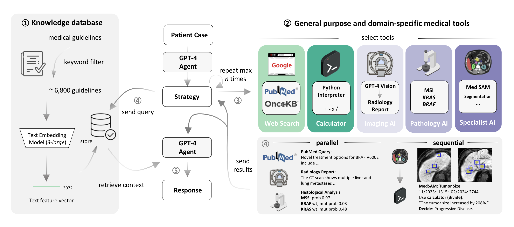

<a name="multimodal-precision-oncology-agent"></a>

<h1 align="center">Multimodal precision-oncology agent</h1>

<p align="center">
  <strong>Clinical reasoning across imaging, pathology and genomics</strong><br/>
  A clinical agent harness connecting language-model reasoning with imaging, pathology, genomic information, and medical evidence.
</p>

<p align="center">
  <a href="https://www.nature.com/articles/s43018-025-00991-6">
    
  </a>
</p>



*Project overview from the existing repository. See the [publication](https://www.nature.com/articles/s43018-025-00991-6) for the study figures, methods, and accompanying credits.*

- 📄 **Publication:** [**Nature Cancer · 2025**](https://www.nature.com/articles/s43018-025-00991-6)  
  *Development and validation of an autonomous artificial intelligence agent for clinical decision-making in oncology*  
  Ferber et al. · Nature Cancer 6, 1337–1349 (2025).
- 📊 [**Published results**](#published-results)
- 🧩 [**Agent harness**](#agent-harness)
- 🗂️ [**Code map**](#code-map)
- ⚙️ [**Getting started**](#getting-started)
- 📚 [**Citation / BibTeX**](#citation)

The study investigates how a GPT-4-based agent can select tools, chain their outputs, and combine multimodal findings with clinical knowledge to answer precision-oncology questions. The harness brings together pathology models, medical-image analysis, genomic interpretation, literature search, and evidence-grounded response generation.

<a name="published-results"></a>

## 📊 Published results

Four medical reviewers evaluated 20 constructed patient scenarios combining simulated histories with real imaging/pathology data and genomic profiles. The following are the results reported for the study system.

| Evaluation axis | Agent result | Definition or comparator |
| --- | --- | --- |
| Completeness | **87.2%** (95/109) | Expected clinical decisions covered; **30.3%** (33/109) with GPT-4 alone |
| Correctness | **91.0%** (223/245) | Statements judged factually correct |
| Helpfulness | **94.0%** (63/67) | User questions or instructions effectively addressed |
| Required tool use | **87.5%** (56/64) | Required tool invocations successfully completed |

The GPT-4-alone comparison above applies to completeness. Reviewers assessed the other axes separately; see [Figure 4 and the supplementary material](https://www.nature.com/articles/s43018-025-00991-6#Fig4) for scoring definitions and the full evaluation.

<a name="agent-harness"></a>

## 🧩 Agent harness

The workflow combines three stages:

1. **Reason and select tools:** interpret the question and patient context, then identify useful analyses.
2. **Execute and integrate:** coordinate tool calls and use their outputs in subsequent reasoning steps.
3. **Ground and synthesize:** combine the resulting evidence with clinical documents and return a referenced answer.

The research system integrates medical-image segmentation with MedSAM, pathology-model inference, OncoKB, PubMed and web search, calculation, and document retrieval. Tool interfaces and orchestration are organized separately from evidence indexing and response evaluation.

<a name="code-map"></a>

## 🗂️ Code map

Implementation files are under [RAGent/DSPY/](RAGent/DSPY/).

| Area | Entry points |
| --- | --- |
| Agent orchestration | [med_agent.py](RAGent/DSPY/med_agent.py) |
| Clinical tool interfaces | [agent_tools.py](RAGent/DSPY/agent_tools.py) |
| Experiment walkthrough | [run_experiment.ipynb](RAGent/DSPY/run_experiment.ipynb) |
| Retrieval and evidence synthesis | [rag.py](RAGent/DSPY/rag.py), [chroma_db_retriever.py](RAGent/DSPY/chroma_db_retriever.py) |
| Citation handling and prompts | [citations_utils.py](RAGent/DSPY/citations_utils.py), [signatures.py](RAGent/DSPY/signatures.py) |
| Indexing and preprocessing | [embed.py](RAGent/DSPY/embed.py), [filter_data_sources.py](RAGent/DSPY/filter_data_sources.py), [deduplicate_data.py](RAGent/DSPY/deduplicate_data.py), [preprocess_sources.py](RAGent/DSPY/preprocess_sources.py) |
| Configuration | [rag_config.py](RAGent/DSPY/rag_config.py), [rag_utils.py](RAGent/DSPY/rag_utils.py) |

<a name="getting-started"></a>

## ⚙️ Getting started

### Environment

The original experiments used Python 3.11.6. Install the dependencies in an isolated environment:

```bash
git clone https://github.com/Dyke-F/LLM_RAG_Agent.git
cd LLM_RAG_Agent
python3.11 -m venv medvenv
source medvenv/bin/activate
python -m pip install -r requirements.txt
```

Tool-specific computation may use a CUDA-capable GPU. Model and external-service access should be configured for the components you intend to use.

### Credentials and configuration

Keep API credentials in a local `.env` file at the repository root. The existing configuration uses:

```dotenv
OPENAI_API_KEY=your_openai_api_key
COHERE_API_KEY=your_cohere_api_key
GOOGLE_API_KEY=your_google_api_key
GOOGLE_SEARCH_ENGINE=your_search_engine_id
```

For OncoKB-enabled workflows, arrange the appropriate access through [OncoKB](https://www.oncokb.org/api-access) and configure the tool for your authorized environment. Do not commit credentials.

[rag_config.py](RAGent/DSPY/rag_config.py) defines document locations, the Chroma collection and storage path, chunking, and model settings. [rag_utils.py](RAGent/DSPY/rag_utils.py) defines the document metadata used during indexing. Model identifiers in the repository describe the original experimental setup; check service availability before a run and record any changes as part of your experimental configuration.

<a name="working-with-the-pipeline"></a>

## 🔬 Working with the pipeline

### 1. Prepare the evidence corpus

Use clinical documents that you are authorized to process. One source used in the project is the [Meditron guidelines collection](https://huggingface.co/datasets/epfl-llm/guidelines); review the source documents' terms before use.

The preprocessing utilities support topic filtering, duplicate removal, and document IDs:

- [scrape_meditron.py](RAGent/DSPY/scrape_meditron.py): obtain the source collection.
- [filter_data_sources.py](RAGent/DSPY/filter_data_sources.py): select relevant documents and topics.
- [deduplicate_data.py](RAGent/DSPY/deduplicate_data.py): remove duplicate records.
- [preprocess_sources.py](RAGent/DSPY/preprocess_sources.py): prepare IDs and metadata for indexing.

Set the input and output directories for your local corpus. The embedding stage expects JSONL documents with the text field `clean_text` and the metadata configured for that source.

### 2. Build the evidence index

From `RAGent/DSPY/`, configure `RAGConfig` and start Chroma using the storage path selected in `default_client_path`. In another terminal, run `embed.py` with `--to_embed` set to the intended input files. Keep the collection settings consistent between indexing and retrieval.

### 3. Explore the agent workflow

Open [run_experiment.ipynb](RAGent/DSPY/run_experiment.ipynb) from `RAGent/DSPY/`. It provides an experiment walkthrough for the agent's tool interface and evidence-synthesis workflow. Review the notebook's selected tool configuration, case selection, service settings, and local paths before execution.

For the published evaluation protocol and reported results, use the [paper and its supplementary material](https://www.nature.com/articles/s43018-025-00991-6).

<a name="research-use-and-data-handling"></a>

## 🔒 Research use and data handling

This repository supports research on clinical agent systems. Keep any patient-level inputs, images, generated outputs, and credentials within the environment authorized for those data. Dataset, model, and API access conditions apply independently of the source-code license. Only use external services under the applicable data-use permissions.

The original setup uses caching in DSPy and the retrieval stack. Review the selected cache configuration when comparing experimental runs, and record model, prompt, corpus, and tool settings alongside results.

<a name="citation"></a>

## 📚 Citation

```bibtex
@article{ferber2025oncologyagent,
  title   = {Development and validation of an autonomous artificial intelligence agent for clinical decision-making in oncology},
  author  = {Ferber, Dyke and El Nahhas, Omar S. M. and W{\"o}lflein, Georg and
             Wiest, Isabella C. and Clusmann, Jan and Le{\ss}mann, Marie-Elisabeth and
             Foersch, Sebastian and Lammert, Jacqueline and Tschochohei, Maximilian and
             J{\"a}ger, Dirk and Salto-Tellez, Manuel and Schultz, Nikolaus and
             Truhn, Daniel and Kather, Jakob Nikolas},
  journal = {Nature Cancer},
  volume  = {6},
  pages   = {1337--1349},
  year    = {2025},
  doi     = {10.1038/s43018-025-00991-6},
  url     = {https://doi.org/10.1038/s43018-025-00991-6}
}
```

<a name="licenses-and-attribution"></a>

## ⚖️ Licenses and attribution

Repository code is covered by the existing [MIT license](LICENSE.txt). The [article](https://www.nature.com/articles/s43018-025-00991-6#rightslink) is published under [Creative Commons Attribution 4.0](https://creativecommons.org/licenses/by/4.0/), subject to its third-party credit lines. The study summary above is newly written; the existing repository overview image is retained without modification. External data, model weights, software, and services retain their own terms.
